# The submitted layout in detail

This page describes the contents of
[`RLCMV4_filled.zip`](../RLCMV4_filled.zip), the layout submitted to
[wafer.space](https://wafer.space/), grouped by structure. An overview is
given in the [top-level&nbsp;README](../README.md). All dimensions were read
from the GDS file. Coordinates are in µm in the top cell, with the origin at
the lower left corner of the die.

## Contents

1. [Layout file](#layout-file)
2. [Structures](#structures)
3. [Probe launches](#probe-launches)
4. [MIM capacitors](#mim-capacitors)
5. [Spiral inductors](#spiral-inductors)
6. [Symmetric inductor](#symmetric-inductor)
7. [Transformers](#transformers)
8. [De-embedding structures](#de-embedding-structures)
9. [EM port markers](#em-port-markers)
10. [Pads](#pads)
11. [Other features on the die](#other-features-on-the-die)
12. [Expected values](#expected-values)
13. [Open questions](#open-questions)

## Layout file

| Property | Value |
|---|---|
| Archive | [`RLCMV4_filled.zip`](../RLCMV4_filled.zip), 34 MB |
| Contents | One GDSII file, `RLCMV4_filled.gds`, 190 MB |
| Top cell | `RLCMV4_filled` |
| Bounding box | 1936&nbsp;µm&nbsp;×&nbsp;5122&nbsp;µm |
| Database unit | 1 nm |
| Cells | 1011 |
| Second top-level cell | `$$$CONTEXT_INFO$$$`, the parameter record that [KLayout](https://www.klayout.de/) writes for its parametric cells. It holds no geometry of its own |

### GDS layers

The following GDS layers are used outside the dummy fill and seal ring. The
names are those of the GF180MCU layer table.

| GDS layer | Name | Use on this chip |
|---|---|---|
| 22/0, 31/0, 33/0 | COMP, Pplus, Contact | Substrate contacts under the ground rails and rings |
| 34/0, 36/0, 42/0, 46/0, 81/0 | Metal1 to Metal5 | Windings, launches, lines and capacitor plates |
| 35/0, 38/0, 40/0, 41/0 | Via1 to Via4 | Via arrays that tie the stacked metals together |
| 36/3, 42/3, 46/3, 81/3 | Metal2 to Metal5 slot | Slots in the wide metal of the launches |
| 37/0 | Pad | Pad openings |
| 75/0 | FuseTop | MIM capacitor top plate |
| 117/5, 117/10 | CAP_MK, MIM_L_MK | MIM capacitor markers |
| 201/0 to 207/0 | not in the layer table | [EM port markers](#em-port-markers) |
| 0/0, 111/5, 152/5 | PR boundary, NDMY, PMNDMY | Die outline and markers of the wafer.space ID cells |

### Metal stack

The `gf180mcuD` variant of the PDK has five metal layers, with Metal5 made as
the thick top metal, and the MIM capacitor between Metal4 and Metal5
([variant definition in open_pdks](https://github.com/RTimothyEdwards/open_pdks/blob/master/gf180mcu/Makefile.in),
[metal level options](https://gf180mcu-pdk.readthedocs.io/en/latest/physical_verification/design_manual/drm_02.html)).
The
[PDK sheet resistance table](https://gf180mcu-pdk.readthedocs.io/en/latest/analog/layout/inter_specs/inter_specs_4.html)
gives the following values for that stack:

| Layer | Sheet resistance (Ω/sq) |
|---|---|
| Metal1 to Metal4 | 0.090 ± 0.014 |
| Metal5 as 11 kÅ top metal | 0.04 ± 0.009 |

## Structures

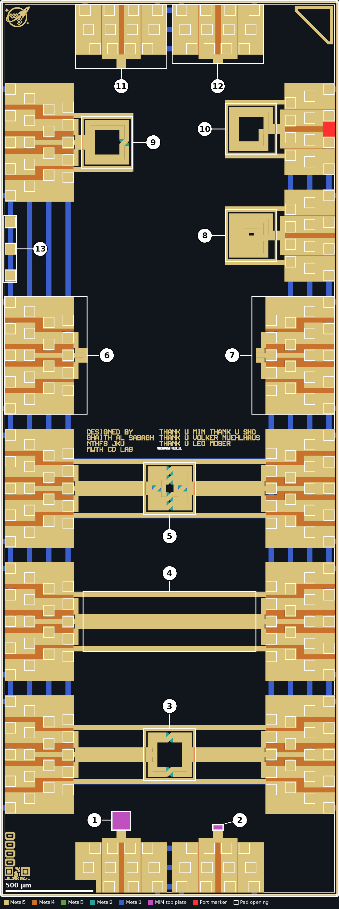

The size is the bounding box of the layout cell as placed and the origin is
its lower left corner. The rotation is that of the cell instance in the top
cell.

| # | Structure | Layout cell | Size (µm) | Origin (µm) | Rotation |
|---|---|---|---|---|---|
| [^1] | MIM capacitor, large | `cap_mim` | 101.2&nbsp;×&nbsp;101.2 | 641.4,&nbsp;384.3 | 0° |
| [^2] | MIM capacitor, small | `cap_mim$1` | 55.2&nbsp;×&nbsp;26.2 | 1216.4,&nbsp;384.3 | 0° |
| [^3] | Transformer, one turn per winding | `SymmetricTransformer` | 298&nbsp;×&nbsp;298 | 819,&nbsp;664 | 270° |
| [^4] | Three-line thru | three Metal5 rectangles in the top cell | 990&nbsp;×&nbsp;82 | 473,&nbsp;1532 | none |
| [^5] | Transformer, two turns per winding | `SymmetricTransformer$2` | 298&nbsp;×&nbsp;298 | 819,&nbsp;2184 | 270° |
| [^6] | Three-port launch, signals joined | `Probes_3P$2$1$2$1` | 447&nbsp;×&nbsp;676 | 26,&nbsp;2755 | 0° |
| [^7] | Three-port launch, signals open | `Probes_3P$2$2$1$1` | 447&nbsp;×&nbsp;676 | 1463,&nbsp;2755 | 180° |
| [^8] | Spiral inductor, four turns | `SpiralInductor_2P_282x282$1` | 298&nbsp;×&nbsp;298 | 1284.7,&nbsp;3628 | 0° |
| [^9] | Symmetric inductor with centre tap | `SymmetricInductor_3P_282x282` | 298&nbsp;×&nbsp;298 | 462,&nbsp;4160 | 270° |
| [^10] | Spiral inductor, two turns | `SpiralInductor_2P_282x282` | 298&nbsp;×&nbsp;298 | 1284.7,&nbsp;4236 | 0° |
| [^11] | Two-port launch, signals joined | `Probes_2P_DEEMD$1` | 524&nbsp;×&nbsp;338.3 | 430,&nbsp;4757.7 | 90° |
| [^12] | Two-port launch, signals open | `Probes_2P_DEEMD` | 524&nbsp;×&nbsp;338.3 | 982,&nbsp;4757.7 | 90° |
| [^13] | Unconnected bond pads | three of `Bondpad_5LM` | 68&nbsp;×&nbsp;369.3 | 26,&nbsp;3515 | 90°, mirrored |

[^1]: MIM capacitor with a 100 µm × 100 µm top plate, in series between the two signal pads of a two-port launch on the bottom edge.
[^2]: MIM capacitor with a 54 µm × 25 µm top plate, in series between the two signal pads of a two-port launch on the bottom edge.
[^3]: Two interleaved single-turn windings on two rings of 26 µm track, between three-port launches on the left and right edges.
[^4]: Three parallel Metal5 lines, 990 µm long, between three-port launches on the left and right edges.
[^5]: Two interleaved two-turn windings on four rings of 24 µm track, between three-port launches on the left and right edges.
[^6]: A three-port launch on the left edge with its three signal stubs joined by a Metal5 bar.
[^7]: A three-port launch on the right edge with its three signal stubs left open.
[^8]: Square spiral, four turns of 26 µm track, on a two-port launch on the right edge.
[^9]: Square symmetric inductor, two turns of 26 µm track with a centre tap, on a three-port launch on the left edge.
[^10]: Square spiral, two turns of 26 µm track, on a two-port launch on the right edge.
[^11]: A two-port launch on the top edge with its two signal stubs joined.
[^12]: A two-port launch on the top edge with its two signal stubs left open.
[^13]: Frame pads 50, 51 and 52 on the left edge, which connect to nothing.

## Probe launches

A launch is a block of pads at the die edge. Its first row consists of bond
pads of the wafer.space frame. The launch cell adds two or three further rows
towards the centre of the die, at smaller pitches and connected to the same
nets. A structure can therefore be contacted by wire bonds on the frame row
or by a wafer probe on any row. The two launch types compare as follows:

| Property | Two-port launch | Three-port launch |
|---|---|---|
| Layout cells | `Probes_2P`, `Probes_2P_DEEMD` and their copies | `Probes_3P` and its copies |
| Cell size (µm) | 338.3&nbsp;×&nbsp;524 | 447&nbsp;×&nbsp;676 |
| Pad order | G S1 S2 G | G S1 S2 S3 G |
| Pad openings, with the frame row | 12 | 19 |
| Instances | 6 | 9 |
| Used by | [^1] [^2] [^8] [^10] [^11] [^12] | [^3] [^4] [^5] [^6] [^7] [^9] |

`Probes_2P` and `Probes_2P_DEEMD` have the same outline, the same pad
positions and the same sub-cells. They differ in one polygon each on Metal2,
Metal3 and Metal4. `Probes_2P` is used for the two spiral inductors and
`Probes_2P_DEEMD` for the two capacitors and for [^11] and [^12].

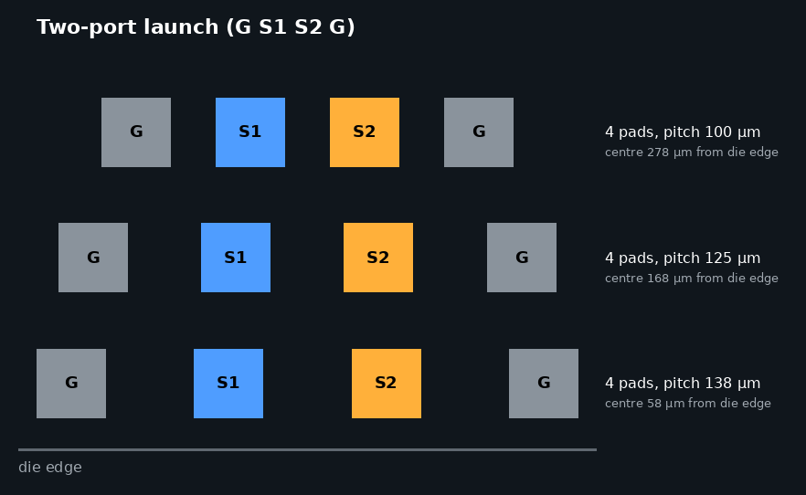

*Pad rows of a two-port launch on the top or bottom edge.*

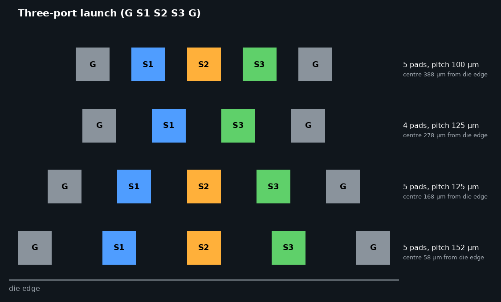

*Pad rows of a three-port launch.*

The rows of each launch, counted from the die edge inwards, are:

| Row | Distance of the pad centre from the die edge (µm) | Pitch, two-port (µm) | Pitch, three-port (µm) |
|---|---|---|---|
| 1, frame row | 58 | 138 on the top and bottom edges, 152 on the left and right edges | 152 |
| 2 | 168 | 125 | 125 |
| 3 | 278 | 100 | 125, four pads: G S1 S3 G |
| 4 | 388 | none | 100 |

Every pad opening is 60 µm × 60 µm. The pad names G, S1, S2 and S3 are
defined by this documentation, because the layout carries no pin labels. S1
is the signal pad with the
lowest x coordinate on the top and bottom edges and the lowest y coordinate on
the left and right edges.

### Ground connections

| Item | Description |
|---|---|
| Ground pads | The outer two pads of every row of every launch |
| Ground rails | Two bars, 25 µm wide, on Metal1 to Metal5 with substrate contacts, above and below each inductor and transformer. On the rows with two launches they run from the left launch to the right launch |
| Ground ring | Each inductor and transformer cell has a ring on Metal1 to Metal5 around the winding, 298 µm across. The ring is cut and does not form a closed loop |
| Ties between launches | Metal1 straps, 28 µm wide, run along the left and right edges and join the ground of every launch on those edges |
| Substrate | Every ground net has P+ substrate contacts |

Traced through the metal and via layers alone, the launches on the left and
right edges share one ground net, the two launches on the bottom edge share a
second and the two on the top edge a third. The Metal1 straps of all three
continue to the seal ring, which was left out of the trace.

## MIM capacitors

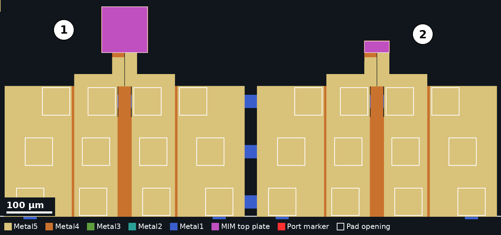

| Property | [^1] | [^2] |
|---|---|---|
| Layout cell | `cap_mim` | `cap_mim$1` |
| Top plate, FuseTop and Metal5 (µm) | 100&nbsp;×&nbsp;100 | 54&nbsp;×&nbsp;25 |
| Bottom plate, Metal4 (µm) | 101.2&nbsp;×&nbsp;101.2 | 55.2&nbsp;×&nbsp;26.2 |
| Via4 cuts on the top plate | 17161 | 2240 |
| Launch | `Probes_2P_DEEMD$1$1`, bottom edge | `Probes_2P_DEEMD$2`, bottom edge |
| Frame pads G, S1, S2, G | 1, 2, 3, 4 | 5, 6, 7, 8 |
| S1 connects to | bottom plate | bottom plate |
| S2 connects to | top plate | top plate |

The bottom plate overlaps the top plate by 0.6 µm on every side, which is
the minimum in the
[MIM option B rules](https://gf180mcu-pdk.readthedocs.io/en/latest/physical_verification/design_manual/drm_10_4_2.html).
The same rules cap a single MIM at 100 µm × 100 µm, so [^1] is the largest
capacitor the process allows in one piece.

Each capacitor is a series element between S1 and S2. Neither plate is tied to
ground. The stub from S1 reaches the bottom plate through a 26 µm × 10 µm
Metal4 tab, and the stub from S2 runs on Metal5 onto the top plate.

The matching [de-embedding structures](#de-embedding-structures) are [^11]
and [^12], which use the same launch cell.

## Spiral inductors

| Two turns [^10] | Four turns [^8] |
|---|---|
| 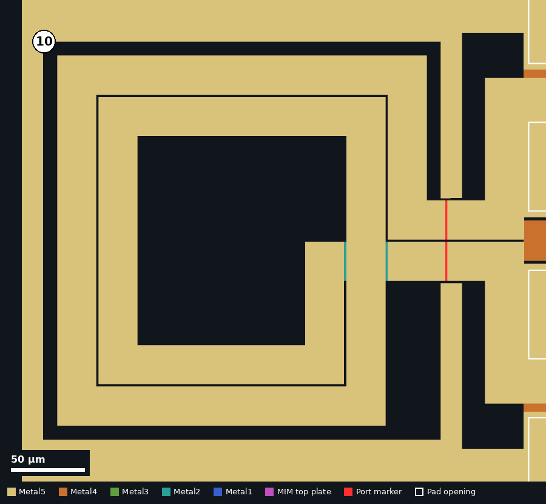 | 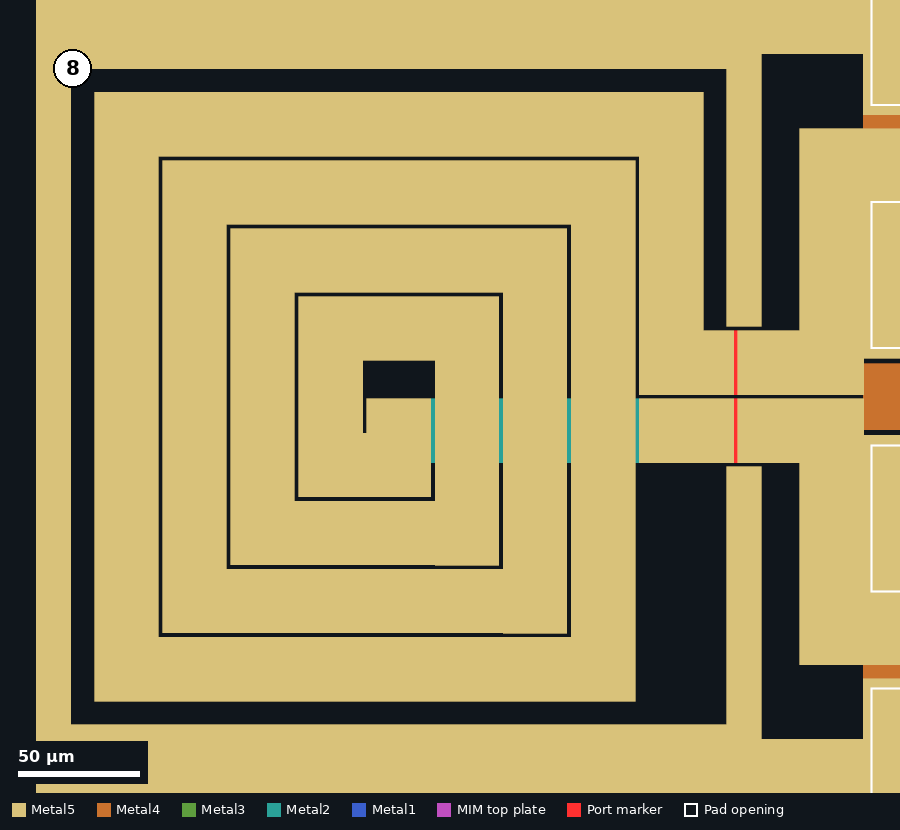 |

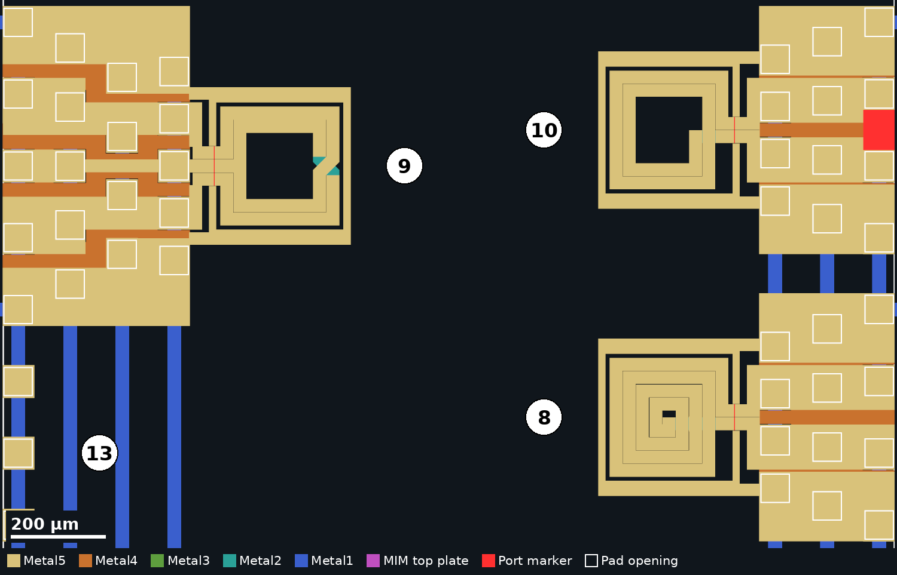

*The two spiral inductors (right) and the symmetric inductor (left) on their
launches.*

| Property | [^10] | [^8] |
|---|---|---|
| Layout cell | `SpiralInductor_2P_282x282` | `SpiralInductor_2P_282x282$1` |
| Shape | square spiral | square spiral |
| Turns | 2 | 4 |
| Outer dimension of the winding (µm) | 250&nbsp;×&nbsp;250 | 250&nbsp;×&nbsp;250 |
| Track width (µm) | 26 | 26 |
| Spacing between turns (µm) | 2 | 2 |
| Inner opening (µm) | 142&nbsp;×&nbsp;142 | 30&nbsp;×&nbsp;30 |
| Winding metals | Metal1 to Metal5, stacked | Metal1 to Metal5, stacked |
| Underpass from the inner end | Metal1 and Metal2, 26 µm wide | Metal1 and Metal2, 26 µm wide |
| Ground ring, outer (µm) | 298&nbsp;×&nbsp;298 | 298&nbsp;×&nbsp;298 |
| Gap from winding to ring (µm) | 10 | 10 |
| Launch | `Probes_2P`, right edge | `Probes_2P$3`, right edge |
| Frame pads G, S1, S2, G | 33, 34, 35, 36 | 29, 30, 31, 32 |
| S1 connects to | inner end, through the underpass | inner end, through the underpass |
| S2 connects to | outer end | outer end |
| Stand-alone GDS | [`Ind2_D250_N2_W26_TO_CLEAN.gds`](../seperate_GDSs/Ind2_D250_N2_W26_TO_CLEAN.gds) | none |

The winding is drawn as straight segments, each a strip of all five metals
with a full array of Via1 to Via4 cuts, so the five metals carry current in
parallel. Where the underpass crosses, the turns above it are cut on Metal1
and Metal2 and continue on Metal3 to Metal5.

The turn counts are read from the layout and, for [^10], from the `N2` in the
name of its stand-alone file. The spirals do not end exactly where they start,
so the electrical turn count is close to but not exactly a whole number.

A stray rectangle on port layer 201, 65.3 µm × 84 µm, lies between frame
pads 34 and 35 in the top cell, with its lower left corner at
1844.7,&nbsp;4343. It is the red block at the right edge of the pictures and
is not part of any cell.

No [de-embedding structure](#de-embedding-structures) uses the `Probes_2P`
cell. The two-port de-embedding launches [^11] and [^12] use `Probes_2P_DEEMD`, which has the
same pads.

## Symmetric inductor

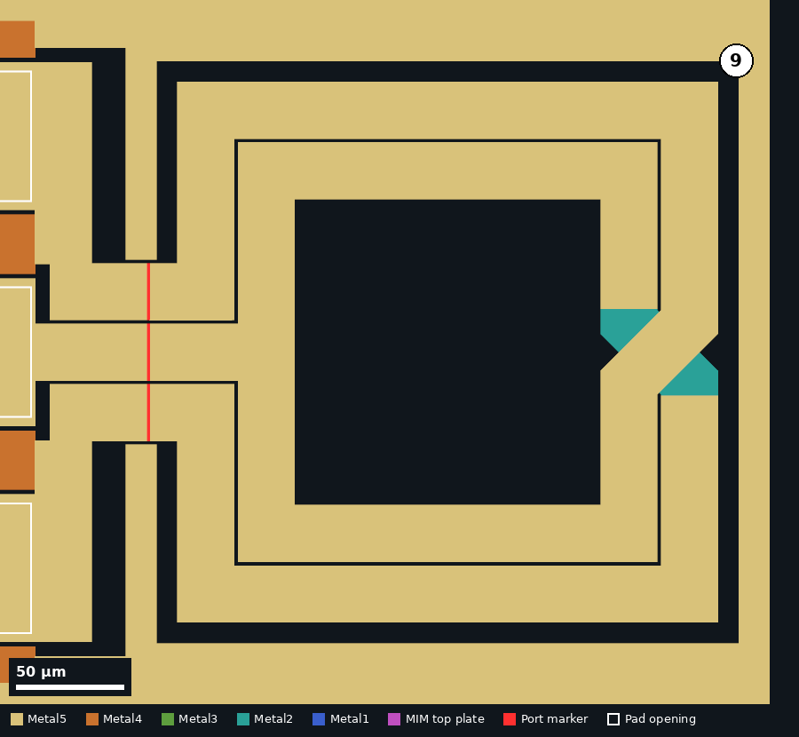

| Property | [^9] |
|---|---|
| Layout cell | `SymmetricInductor_3P_282x282` |
| Shape | square, symmetric about the axis through the terminals |
| Turns | 2 |
| Outer dimension of the winding (µm) | 250&nbsp;×&nbsp;250 |
| Track width (µm) | 26 |
| Spacing between turns (µm) | 2 |
| Inner opening (µm) | 142&nbsp;×&nbsp;142 |
| Winding metals | Metal1 to Metal5, stacked |
| Crossover | one, on the side away from the terminals. One path uses Metal3 to Metal5 and the other Metal1 and Metal2 |
| Centre tap | from the middle of the inner turn, out between the two ends |
| Terminal pitch (µm) | 28 |
| Ground ring, outer (µm) | 298&nbsp;×&nbsp;298 |
| Launch | `Probes_3P`, left edge |
| Frame pads G, S1, S2, S3, G | 49, 48, 47, 46, 45 |
| S1 and S3 connect to | the two ends of the winding |
| S2 connects to | the centre tap |
| Stand-alone GDS | [`Ind3_D250_N2_W26_TO_CLEAN.gds`](../seperate_GDSs/Ind3_D250_N2_W26_TO_CLEAN.gds) |

The cell is placed rotated by 270°, so its terminals face the launch on the
left. The winding is a DC short between all three pads, so a continuity check
between S1, S2 and S3 is expected to read about 1 Ω on a functional die (see
[DC resistance](#dc-resistance)).

The matching [de-embedding structures](#de-embedding-structures) are [^6] and
[^7].

## Transformers

| One turn per winding [^3] | Two turns per winding [^5] |
|---|---|
| 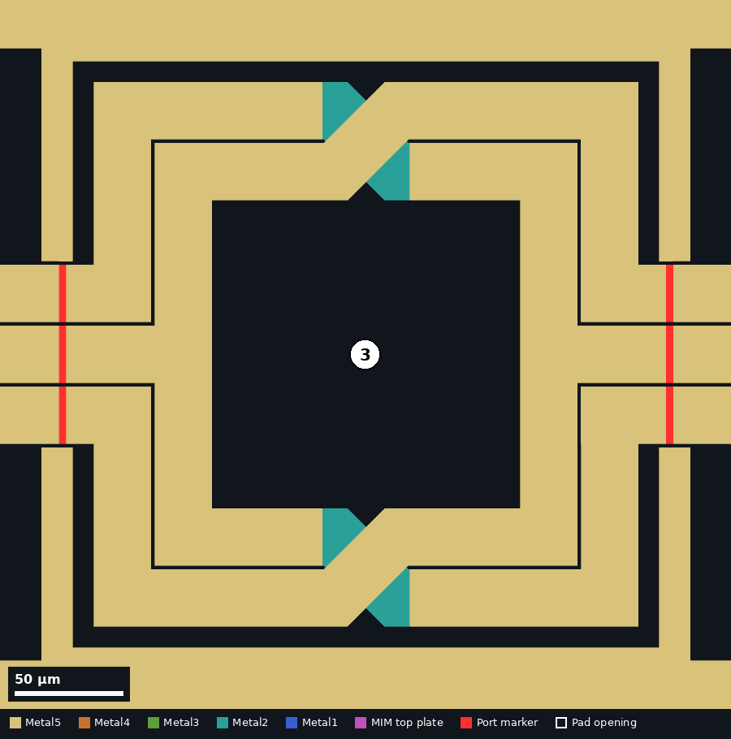 | 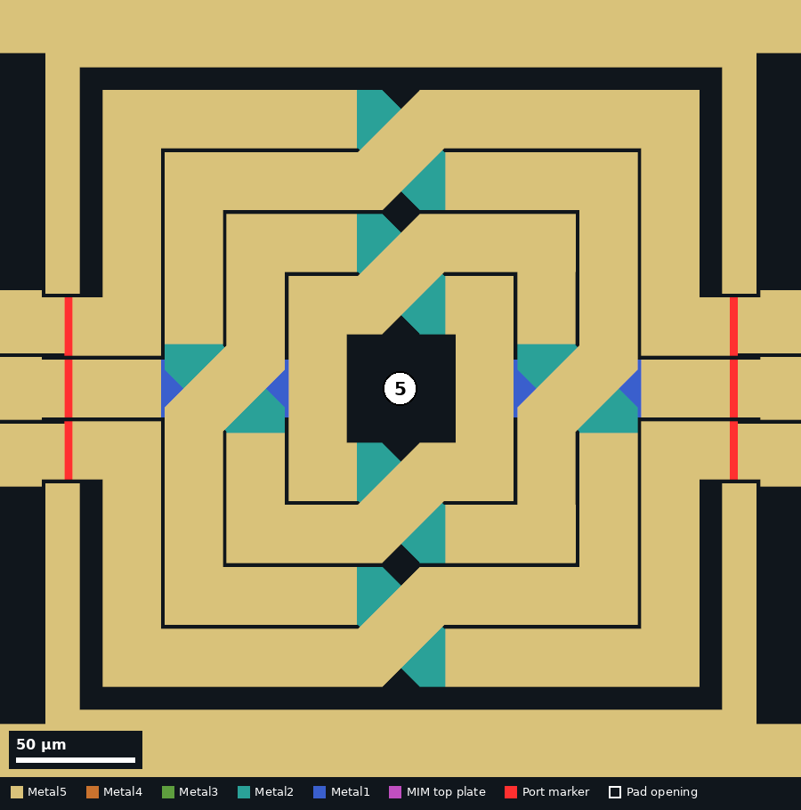 |

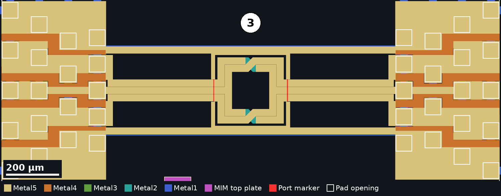

*Transformer 3 with its feed lines, ground rails and launches.*

The two windings are named A and B in this documentation.

| Property | [^3] | [^5] |
|---|---|---|
| Layout cell | `SymmetricTransformer` | `SymmetricTransformer$2` |
| Windings | 2, interleaved | 2, interleaved |
| Concentric rings | 2 | 4 |
| Turns per winding | 1 | 2 |
| Outer dimension of the winding (µm) | 250&nbsp;×&nbsp;250 | 250&nbsp;×&nbsp;250 |
| Track width (µm) | 26 | 24 |
| Spacing between rings (µm) | 2 | 2 |
| Winding metals | Metal1 to Metal5, stacked | Metal1 to Metal5, stacked |
| Crossovers | one path stays on the upper metals, the other drops to the lower metals | one path stays on the upper metals, the other drops to the lower metals |
| Ground ring, outer (µm) | 298&nbsp;×&nbsp;298, in two halves | 298&nbsp;×&nbsp;298, in two halves |
| Feed lines | three Metal5 lines per side, 26 µm wide on a 28 µm pitch, 357 µm long | three Metal5 lines per side, 26 µm wide on a 28 µm pitch, 344 µm long |
| Left launch | `Probes_3P$2`, frame pads 72 to 68 | `Probes_3P$2$1$2`, frame pads 62 to 58 |
| Right launch | `Probes_3P$2$1$1`, frame pads 9 to 13 | `Probes_3P$2$2$1`, frame pads 19 to 23 |
| Left S1 and S3 | ends of winding A | ends of winding A |
| Left S2 | centre tap of winding B | centre tap of winding A |
| Right S1 and S3 | ends of winding B | ends of winding B |
| Right S2 | centre tap of winding A | centre tap of winding B |

The turn counts follow from the layout: the rings are shared equally between
two windings that are mirror images of each other. The pad assignments come
from tracing the metal. In [^3] the left S1 and S3 pads and the right S2 pad
are one DC net and the remaining three signal pads are another. In [^5] the
three signal pads on the left are one DC net and the three on the right
another. A continuity check on a functional die is expected to show these
nets.

The repository does not record which winding is intended as the primary.

The matching [de-embedding structures](#de-embedding-structures) are [^4],
[^6] and [^7].

## De-embedding structures

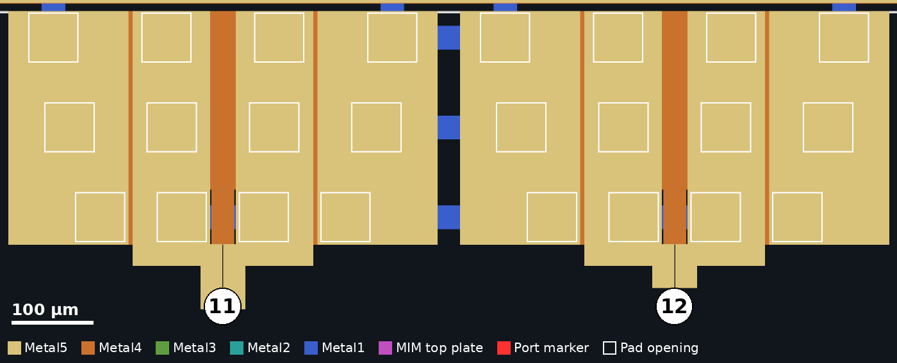

*Two-port launches on the top edge: structure 11 (left, signals joined) and
structure 12 (right, signals open).*

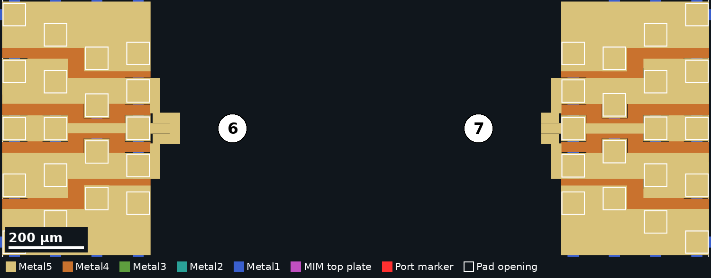

*Three-port launches: structure 6 (left edge, signals joined) and structure 7
(right edge, signals open).*

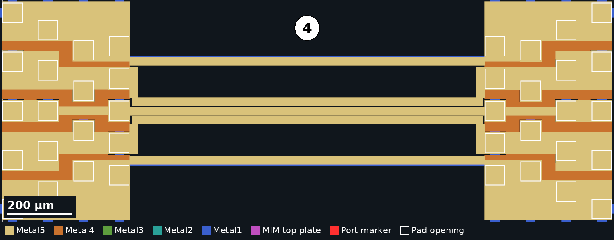

*Structure 4, the three-line thru between two three-port launches.*

| # | Launch cell | Edge | Frame pads | What joins the signal pads |
|---|---|---|---|---|
| [^11] | `Probes_2P_DEEMD$1` | top | 44 to 41 | S1 and S2 joined on Metal5 at the end of the stubs |
| [^12] | `Probes_2P_DEEMD` | top | 40 to 37 | nothing |
| [^6] | `Probes_3P$2$1$2$1` | left | 57 to 53 | a Metal5 bar, 26&nbsp;µm&nbsp;×&nbsp;82&nbsp;µm, across all three stubs |
| [^7] | `Probes_3P$2$2$1$1` | right | 24 to 28 | nothing |
| [^4] | `Probes_3P$2$1` and `Probes_3P$2$2` | left and right | 67 to 63 and 14 to 18 | three Metal5 lines, 26 µm wide on a 28 µm pitch, 990 µm long |

The thru [^4] has the same ground rails above and below it as the two
transformers, 307 µm apart, so it is also a measurement of the feed lines
those transformers use. The transformer feed lines are 357 µm and 344 µm
long per side, against 990 µm for the thru.

In [^6] and [^11] the signal pads are joined to each other and, as traced
through the metal, not to the ground pads. They are therefore not a short to
ground. The repository does not record which de-embedding method these
structures were drawn for.

## EM port markers

The inductor and transformer cells carry small rectangles on GDS layers 201
to 207 across their terminals. The
[gds2openEMS user guide](https://github.com/VolkerMuehlhaus/gds2openEMS/blob/main/doc/userguide_md_format/Using_OpenEMS_Python_with_IHP_SG13G2_v3.md)
describes this convention: "Ports are created from polygons on special GDSII
layers (by convention, layer 201 and above)". Layer 204 is not used.

| Cell | Port layer | Terminal it marks | Launch pad |
|---|---|---|---|
| `SpiralInductor_2P_282x282`, `SpiralInductor_2P_282x282$1` | 201 | outer end | S2 |
| | 202 | inner end | S1 |
| `SymmetricInductor_3P_282x282` | 201 | one end | S1 |
| | 202 | other end | S3 |
| | 203 | centre tap | S2 |
| `SymmetricTransformer`, `SymmetricTransformer$2` | 201 | left side, end | left S1 |
| | 202 | left side, end | left S3 |
| | 206 | left side, centre | left S2 |
| | 203 | right side, end | right S1 |
| | 205 | right side, end | right S3 |
| | 207 | right side, centre | right S2 |

The capacitors, launches and lines have no port markers. No model script that
maps these layers to port numbers is included in the repository.

## Pads

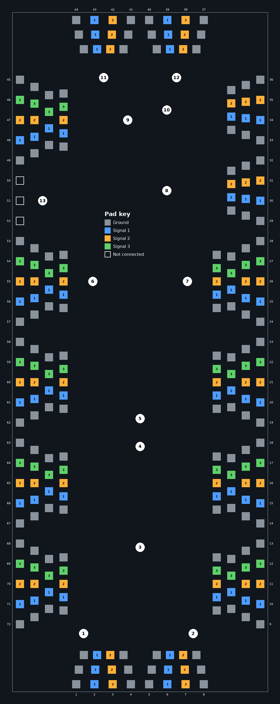

The die has 246 pad openings. 72 of them are the bond pads of the wafer.space
frame, numbered here counterclockwise from the lower left corner: 1 to 8 along
the bottom edge, 9 to 36 up the right edge, 37 to 44 along the top edge from
right to left and 45 to 72 down the left edge. The other 174 are the inner
rows of the launches.

### Frame pads of each launch

The frame pads of each launch are listed in order along the die edge.

| Structure | Die edge | G | S1 | S2 | S3 | G | Pad openings |
|---|---|---|---|---|---|---|---|
| [^1] | bottom | 1 | 2 | 3 | none | 4 | 12 |
| [^2] | bottom | 5 | 6 | 7 | none | 8 | 12 |
| [^3] | left | 72 | 71 | 70 | 69 | 68 | 19 |
| [^3] | right | 9 | 10 | 11 | 12 | 13 | 19 |
| [^4] | left | 67 | 66 | 65 | 64 | 63 | 19 |
| [^4] | right | 14 | 15 | 16 | 17 | 18 | 19 |
| [^5] | left | 62 | 61 | 60 | 59 | 58 | 19 |
| [^5] | right | 19 | 20 | 21 | 22 | 23 | 19 |
| [^6] | left | 57 | 56 | 55 | 54 | 53 | 19 |
| [^7] | right | 24 | 25 | 26 | 27 | 28 | 19 |
| [^8] | right | 29 | 30 | 31 | none | 32 | 12 |
| [^9] | left | 49 | 48 | 47 | 46 | 45 | 19 |
| [^10] | right | 33 | 34 | 35 | none | 36 | 12 |
| [^11] | top | 44 | 43 | 42 | none | 41 | 12 |
| [^12] | top | 40 | 39 | 38 | none | 37 | 12 |

### All frame pads

<details>
<summary>All 72 frame pads</summary>

The text labels are left over from the wafer.space frame template, where each
pad had an I/O cell. They name the template's signals and have no meaning on
this chip. Sixteen pads have no such label.

| Pad | Centre (µm) | Role | Text label at the pad |
|---|---|---|---|
| 1 | 485,&nbsp;58 | G | `clk_PAD` |
| 2 | 623,&nbsp;58 | S1 | `rst_n_PAD` |
| 3 | 761,&nbsp;58 | S2 | `input_PAD[0]` |
| 4 | 899,&nbsp;58 | G | none |
| 5 | 1037,&nbsp;58 | G | none |
| 6 | 1175,&nbsp;58 | S1 | `input_PAD[1]` |
| 7 | 1313,&nbsp;58 | S2 | `input_PAD[2]` |
| 8 | 1451,&nbsp;58 | G | `input_PAD[3]` |
| 9 | 1878,&nbsp;509 | G | `bidir_PAD[0]` |
| 10 | 1878,&nbsp;661 | S1 | `bidir_PAD[1]` |
| 11 | 1878,&nbsp;813 | S2 | none |
| 12 | 1878,&nbsp;965 | S3 | none |
| 13 | 1878,&nbsp;1117 | G | `bidir_PAD[2]` |
| 14 | 1878,&nbsp;1269 | G | `bidir_PAD[3]` |
| 15 | 1878,&nbsp;1421 | S1 | `bidir_PAD[4]` |
| 16 | 1878,&nbsp;1573 | S2 | `bidir_PAD[5]` |
| 17 | 1878,&nbsp;1725 | S3 | `bidir_PAD[6]` |
| 18 | 1878,&nbsp;1877 | G | `bidir_PAD[7]` |
| 19 | 1878,&nbsp;2029 | G | `bidir_PAD[8]` |
| 20 | 1878,&nbsp;2181 | S1 | `bidir_PAD[9]` |
| 21 | 1878,&nbsp;2333 | S2 | `bidir_PAD[10]` |
| 22 | 1878,&nbsp;2485 | S3 | none |
| 23 | 1878,&nbsp;2637 | G | none |
| 24 | 1878,&nbsp;2789 | G | `bidir_PAD[11]` |
| 25 | 1878,&nbsp;2941 | S1 | `bidir_PAD[12]` |
| 26 | 1878,&nbsp;3093 | S2 | `bidir_PAD[13]` |
| 27 | 1878,&nbsp;3245 | S3 | `bidir_PAD[14]` |
| 28 | 1878,&nbsp;3397 | G | `bidir_PAD[15]` |
| 29 | 1878,&nbsp;3549 | G | `bidir_PAD[16]` |
| 30 | 1878,&nbsp;3701 | S1 | `bidir_PAD[17]` |
| 31 | 1878,&nbsp;3853 | S2 | `bidir_PAD[18]` |
| 32 | 1878,&nbsp;4005 | G | `bidir_PAD[19]` |
| 33 | 1878,&nbsp;4157 | G | none |
| 34 | 1878,&nbsp;4309 | S1 | none |
| 35 | 1878,&nbsp;4461 | S2 | `bidir_PAD[20]` |
| 36 | 1878,&nbsp;4613 | G | `bidir_PAD[21]` |
| 37 | 1451,&nbsp;5064 | G | `analog_PAD[0]` |
| 38 | 1313,&nbsp;5064 | S2 | `analog_PAD[1]` |
| 39 | 1175,&nbsp;5064 | S1 | `analog_PAD[2]` |
| 40 | 1037,&nbsp;5064 | G | none |
| 41 | 899,&nbsp;5064 | G | none |
| 42 | 761,&nbsp;5064 | S2 | `analog_PAD[3]` |
| 43 | 623,&nbsp;5064 | S1 | `analog_PAD[4]` |
| 44 | 485,&nbsp;5064 | G | `analog_PAD[5]` |
| 45 | 58,&nbsp;4613 | G | `bidir_PAD[22]` |
| 46 | 58,&nbsp;4461 | S3 | `bidir_PAD[23]` |
| 47 | 58,&nbsp;4309 | S2 | none |
| 48 | 58,&nbsp;4157 | S1 | none |
| 49 | 58,&nbsp;4005 | G | `bidir_PAD[24]` |
| 50 | 58,&nbsp;3853 | NC | `bidir_PAD[25]` |
| 51 | 58,&nbsp;3701 | NC | `bidir_PAD[26]` |
| 52 | 58,&nbsp;3549 | NC | `bidir_PAD[27]` |
| 53 | 58,&nbsp;3397 | G | `bidir_PAD[28]` |
| 54 | 58,&nbsp;3245 | S3 | `bidir_PAD[29]` |
| 55 | 58,&nbsp;3093 | S2 | `bidir_PAD[30]` |
| 56 | 58,&nbsp;2941 | S1 | `bidir_PAD[31]` |
| 57 | 58,&nbsp;2789 | G | `bidir_PAD[32]` |
| 58 | 58,&nbsp;2637 | G | none |
| 59 | 58,&nbsp;2485 | S3 | none |
| 60 | 58,&nbsp;2333 | S2 | `bidir_PAD[33]` |
| 61 | 58,&nbsp;2181 | S1 | `bidir_PAD[34]` |
| 62 | 58,&nbsp;2029 | G | `bidir_PAD[35]` |
| 63 | 58,&nbsp;1877 | G | `bidir_PAD[36]` |
| 64 | 58,&nbsp;1725 | S3 | `bidir_PAD[37]` |
| 65 | 58,&nbsp;1573 | S2 | `bidir_PAD[38]` |
| 66 | 58,&nbsp;1421 | S1 | `bidir_PAD[39]` |
| 67 | 58,&nbsp;1269 | G | `bidir_PAD[40]` |
| 68 | 58,&nbsp;1117 | G | none |
| 69 | 58,&nbsp;965 | S3 | none |
| 70 | 58,&nbsp;813 | S2 | `bidir_PAD[41]` |
| 71 | 58,&nbsp;661 | S1 | `bidir_PAD[42]` |
| 72 | 58,&nbsp;509 | G | `bidir_PAD[43]` |

</details>

## Other features on the die

| Item | Cell | Where | Notes |
|---|---|---|---|
| Credits | `Credits` | 496,&nbsp;2543 | Metal5 text: "DESIGNED BY GHAITH AL SABAGH", "NTHFS JKU", "MWTH CD LAB" |
| Thanks | `Thanks` | 911,&nbsp;2576 | Metal5 text: "THANK U MIM THANK U SHO", "THANK U VOLKER MUEHLHAUS", "THANK U LEO MOSER" |
| wafer.space logo | `gf180mcu_ws_ip__logo` | top left corner | from the frame template |
| Corner marker | `gf180mcu_ws_ip__marker` | top right corner | from the frame template |
| QR code, project ID and shuttle ID | `gf180mcu_ws_ip__qrcode_id`, `gf180mcu_ws_ip__project_id`, `gf180mcu_ws_ip__shuttle_id` | bottom left corner | from the frame template |
| Seal ring | `sealring` | die edge | |
| Dummy fill | `COMP_FILL`, `POLY2_FILL`, `METAL1_FILL` to `METAL5_FILL` | whole die | on the dummy datatypes, not shown in the pictures |

## Expected values

The expected values are hand calculations from the drawn geometry and the
typical values of the PDK. They are reproduced by
[`scripts/expected_values.py`](scripts/expected_values.py). No EM simulation
and no measurement is recorded in this repository.

### Capacitance

The capacitance is `C = area × capacitance per area`, with 2.0 fF/µm²
typical and 1.8 to 2.2 fF/µm² as the limits from the
[PDK MIM specification](https://gf180mcu-pdk.readthedocs.io/en/latest/analog/spice/elec_specs/elec_specs_6_4.html).

| # | Area (µm²) | Typical | Minimum | Maximum |
|---|---|---|---|---|
| [^1] | 100&nbsp;×&nbsp;100 = 10000 | 20.0 pF | 18.0 pF | 22.0 pF |
| [^2] | 54&nbsp;×&nbsp;25 = 1350 | 2.70 pF | 2.43 pF | 2.97 pF |

The PDK offers 1.0, 1.5 and 2.0 fF/µm² MIM options and a process run uses
only one. 2.0 fF/µm² is what the `gf180mcuD` tooling assumes. This
repository does not record which option the shuttle was made with. With
another option the capacitance scales in proportion.

### Inductance

The current sheet expression of
[Mohan et al.](https://doi.org/10.1109/4.792620) for a square spiral is

```
L = μ0 · n² · d_avg · (1.27 / 2) · ( ln(2.07 / ρ) + 0.18 ρ + 0.13 ρ² )

d_in  = d_out − 2 · (n · w + (n − 1) · s)
d_avg = (d_out + d_in) / 2
ρ     = (d_out − d_in) / (d_out + d_in)
```

with `n` turns, track width `w`, spacing `s` and outer dimension `d_out`.

| # | n | d_out (µm) | w (µm) | s (µm) | d_in (µm) | ρ | L |
|---|---|---|---|---|---|---|---|
| [^10] | 2 | 250 | 26 | 2 | 142 | 0.276 | 1.30 nH |
| [^8] | 4 | 250 | 26 | 2 | 30 | 0.786 | 2.13 nH |
| [^9] | 2 | 250 | 26 | 2 | 142 | 0.276 | 1.30 nH |

The expression is for a plain spiral in free space. It leaves out the
substrate, the ground ring 10 µm from the winding, the feed stubs, and for
[^9] the crossover and centre tap. The values are therefore order-of-magnitude
estimates.

### DC resistance

Five metals in parallel give a sheet resistance of
`1 / (4 / 0.090 + 1 / 0.04) = 14.4 mΩ/sq`. The number of squares is taken as
the Metal5 area of the winding divided by the track width squared.

| # | Metal5 winding area (µm²) | Squares | DC resistance |
|---|---|---|---|
| [^10] | 39598 | 59 | 0.84 Ω |
| [^8] | 55614 | 82 | 1.18 Ω |
| [^9] | 40981 | 61 | 0.87 Ω |

This calculation counts each corner as a full square and ignores the via
resistance and the higher resistance of the Metal1 and Metal2 underpass, so
the result is approximate. It does not include the launch or the probe
contact.

### Transformers

No hand estimate is given. The winding inductances, the coupling factor and
the self-resonant frequency can only be obtained from an EM simulation.

## Open questions

The following questions cannot be answered from the layout, and the
repository contains no other source of information:

| Question | Status |
|---|---|
| Which openEMS setup and stack file the chip is meant to validate | not named. See [Simulating the structures](../README.md#simulating-the-structures) |
| Simulated S-parameters of any structure | not in the repository |
| Frequency range of interest | not stated |
| Measurement plan: wire bonded on the chip-on-board package, wafer probed, or both, and with which probes | not stated |
| Intended de-embedding method | not stated |
| Which MIM capacitance option the shuttle uses | not stated |
| Primary and secondary of the transformers | not stated |
| Why three frame pads are left unconnected, and what the stray layer 201 rectangle is for | not stated |
| Measured results | none yet. Silicon is expected in November 2026 |
