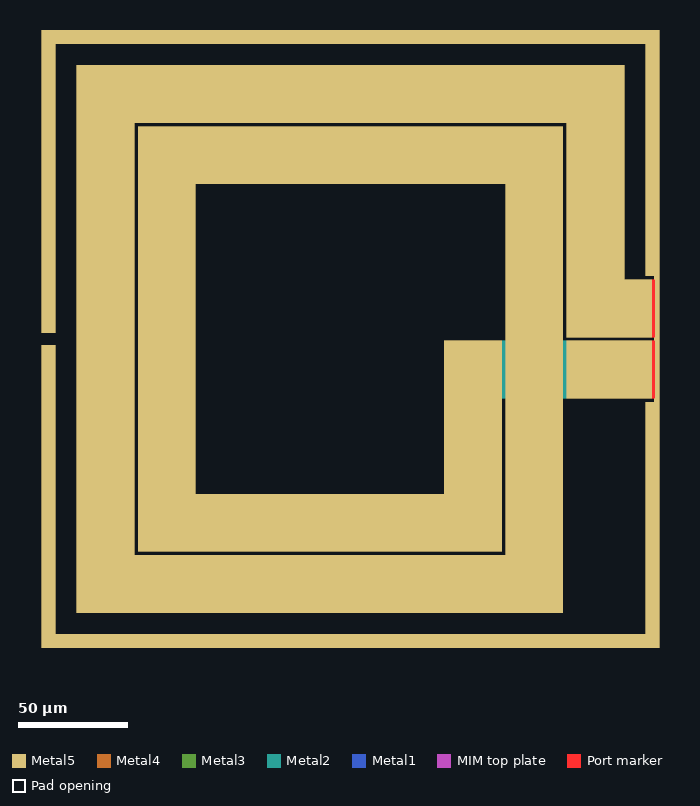
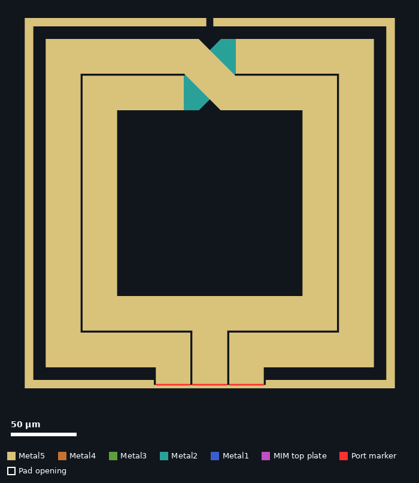
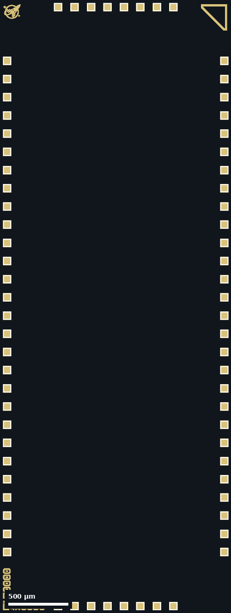
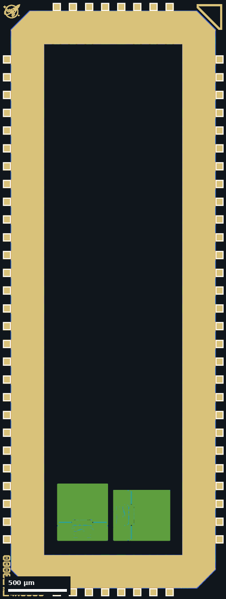

# Stand-alone GDS files

This directory holds building blocks of the RLCM test chip as separate GDS
files: two inductors and two versions of the
[wafer.space](https://wafer.space/) pad frame. The complete chip is
in [`RLCMV4_filled.zip`](../RLCMV4_filled.zip) and is described in
[`docs/README.md`](../docs/README.md). The
[top-level&nbsp;README](../README.md) gives the overview.

The other structures on the chip (the four-turn spiral, the transformers, the
MIM capacitors and the probe launches) have no stand-alone file. They exist
only inside the complete layout.

## Files

| File | Top cell | Size (µm) | Contents |
|---|---|---|---|
| [`Ind2_D250_N2_W26_TO.gds`](Ind2_D250_N2_W26_TO.gds) | `SpiralInductor` | 282&nbsp;×&nbsp;282 | [Spiral inductor](#spiral-inductor), two turns |
| [`Ind2_D250_N2_W26_TO_CLEAN.gds`](Ind2_D250_N2_W26_TO_CLEAN.gds) | `SpiralInductor` | 282&nbsp;×&nbsp;282 | The same with one Metal5 bar removed |
| [`Ind3_D250_N2_W26_TO.gds`](Ind3_D250_N2_W26_TO.gds) | `SymmetricInductor` | 282&nbsp;×&nbsp;282 | [Symmetric inductor](#symmetric-inductor), two turns with centre tap |
| [`Ind3_D250_N2_W26_TO_CLEAN.gds`](Ind3_D250_N2_W26_TO_CLEAN.gds) | `SymmetricInductor` | 282&nbsp;×&nbsp;282 | The same with one Metal5 bar removed |
| [`bare_frame.gds`](bare_frame.gds) | `chip_top` | 1936&nbsp;×&nbsp;5122 | [Pad frame](#pad-frames) with bond pads only |
| [`0p5x1p0_frame.gds`](0p5x1p0_frame.gds) | `chip_top` | 1936&nbsp;×&nbsp;5122 | [Pad frame](#pad-frames) with I/O cells |

Each inductor file also has a second top-level cell, `$$$CONTEXT_INFO$$$`.
[KLayout](https://www.klayout.de/) writes it to record the parameters of its parametric cells, and it
holds no geometry of its own.

## File names

The repository does not explain the inductor file names. The following
reading is consistent with the layout:

| Part of the name | Meaning | In the layout |
|---|---|---|
| `Ind2`, `Ind3` | number of terminals | two terminals, or two terminals and a centre tap |
| `D250` | outer dimension | the winding is 250&nbsp;µm&nbsp;×&nbsp;250&nbsp;µm |
| `N2` | number of turns | two turns |
| `W26` | track width | 26 µm |
| `TO` | not explained in the repository. The project description uses "TO" for the tape-out | |
| `CLEAN` | not explained in the repository. The files were added by the commit "Cleaned DRC :)" on 2026-07-13 | one Metal5 bar fewer than the file without the suffix |

## Spiral inductor

*[`Ind2_D250_N2_W26_TO.gds`](Ind2_D250_N2_W26_TO.gds). The red marks at the
two terminals are the EM port markers.*

| Property | Value |
|---|---|
| Cell | `SpiralInductor` |
| Shape | square spiral |
| Turns | 2 |
| Outer dimension of the winding (µm) | 250&nbsp;×&nbsp;250 |
| Track width (µm) | 26 |
| Spacing between turns (µm) | 2 |
| Inner opening (µm) | 142&nbsp;×&nbsp;142 |
| Winding metals | Metal1 to Metal5, stacked, with Via1 to Via4 arrays |
| Underpass from the inner end | Metal1 and Metal2 |
| Surrounding ring | 6 µm wide on Metal1 to Metal5, 282 µm across, open at the terminals and opposite them |
| Terminals | two, on the right side, 26 µm wide on a 28 µm pitch |
| EM port markers | layer 201 on the outer end, layer 202 on the inner end |
| Sub-cells | 16 `via_dev` cells, one per straight segment |

The two files differ in one polygon:

| File | Difference |
|---|---|
| [`Ind2_D250_N2_W26_TO.gds`](Ind2_D250_N2_W26_TO.gds) | Has a Metal5 bar, 2&nbsp;µm&nbsp;×&nbsp;58&nbsp;µm, that closes the opening of the ring in front of the terminals, 1 µm from the terminal ends |
| [`Ind2_D250_N2_W26_TO_CLEAN.gds`](Ind2_D250_N2_W26_TO_CLEAN.gds) | No such bar. Everything else is identical |

On the chip this inductor is
[structure 10](../docs/README.md#structures), cell
`SpiralInductor_2P_282x282`.
That cell has the same number of polygons on every metal layer as the `CLEAN`
file, and adds a wider ground ring (cell `GRM`, 298 µm across) and a
substrate contact. The details, pads and expected values are given under
[Spiral inductors in `docs/README.md`](../docs/README.md#spiral-inductors).

## Symmetric inductor

*[`Ind3_D250_N2_W26_TO.gds`](Ind3_D250_N2_W26_TO.gds). The red marks at the
three terminals are the EM port markers.*

| Property | Value |
|---|---|
| Cell | `SymmetricInductor` |
| Shape | square, symmetric about the axis through the terminals |
| Turns | 2 |
| Outer dimension of the winding (µm) | 250&nbsp;×&nbsp;250 |
| Track width (µm) | 26 |
| Spacing between turns (µm) | 2 |
| Inner opening (µm) | 142&nbsp;×&nbsp;142 |
| Winding metals | Metal1 to Metal5, stacked, with Via1 to Via4 arrays |
| Crossover | one, opposite the terminals. One path on Metal3 to Metal5, the other on Metal1 and Metal2 |
| Surrounding ring | 6 µm wide on Metal1 to Metal5, 282 µm across, open at the terminals and opposite them |
| Terminals | three, on the bottom side, 26 µm wide on a 28 µm pitch. The middle one is the centre tap |
| EM port markers | layers 201 and 202 on the two ends, layer 203 on the centre tap |
| Sub-cells | 14 `via_dev` cells |

The two files differ in one polygon:

| File | Difference |
|---|---|
| [`Ind3_D250_N2_W26_TO.gds`](Ind3_D250_N2_W26_TO.gds) | Has a Metal5 bar, 86&nbsp;µm&nbsp;×&nbsp;2&nbsp;µm, that closes the opening of the ring in front of the terminals, 1 µm from the terminal ends |
| [`Ind3_D250_N2_W26_TO_CLEAN.gds`](Ind3_D250_N2_W26_TO_CLEAN.gds) | No such bar. Everything else is identical |

On the chip this inductor is [structure 9](../docs/README.md#structures),
cell `SymmetricInductor_3P_282x282`, placed rotated by 270°. That cell is not a plain copy of either file: it has
two more polygons on Metal1 and on Metal2, a wider ground ring (cell
`GRM_SYM`, 298 µm across) and a substrate contact. The details, pads and expected values are given under
[Symmetric inductor in `docs/README.md`](../docs/README.md#symmetric-inductor).

## Pad frames

| [`bare_frame.gds`](bare_frame.gds) | [`0p5x1p0_frame.gds`](0p5x1p0_frame.gds) |
|---|---|
|  |  |

Both files have the outline of the wafer.space 0.5&nbsp;×&nbsp;1 slot and the
same 72 bond pads in the same places. They compare as follows:

| Property | [`bare_frame.gds`](bare_frame.gds) | [`0p5x1p0_frame.gds`](0p5x1p0_frame.gds) |
|---|---|---|
| Added by commit | "Added bare padframe", 2026-07-13 | "Added original padframe", 2026-07-13 |
| Cells | 19 | 1531 |
| Bond pads (`Bondpad_5LM`) | 72 | 72 |
| I/O cells | none | 44 `gf180mcu_fd_io__bi_24t`, 6 `gf180mcu_fd_io__asig_5p0`, 5 `gf180mcu_fd_io__in_c`, 1 `gf180mcu_fd_io__in_s`, 8 `gf180mcu_fd_io__dvdd`, 8 `gf180mcu_fd_io__dvss`, 4 corner cells and filler cells |
| Core | empty | two `gf180mcu_fd_ip_sram__sram512x8m8wm1` SRAM macros |
| wafer.space logo, corner marker, QR code, project ID and shuttle ID cells | yes | yes |
| Pad name text labels | yes | yes |

The bond pads are distributed along the four edges as follows:

| Edge | Bond pads | Pitch (µm) |
|---|---|---|
| Bottom | 8 | 138 |
| Right | 28 | 152 |
| Top | 8 | 138 |
| Left | 28 | 152 |

The chip is built on the bare frame: its top cell has the same 72 bond pads,
the same wafer.space cells and no I/O cells. The pad name labels of the
template, such as `bidir_PAD[20]`, are still present in the chip layout
although the I/O cells they belonged to are gone. The pad numbering used in
this documentation and the label at each pad are listed under
[Pads in `docs/README.md`](../docs/README.md#pads).
